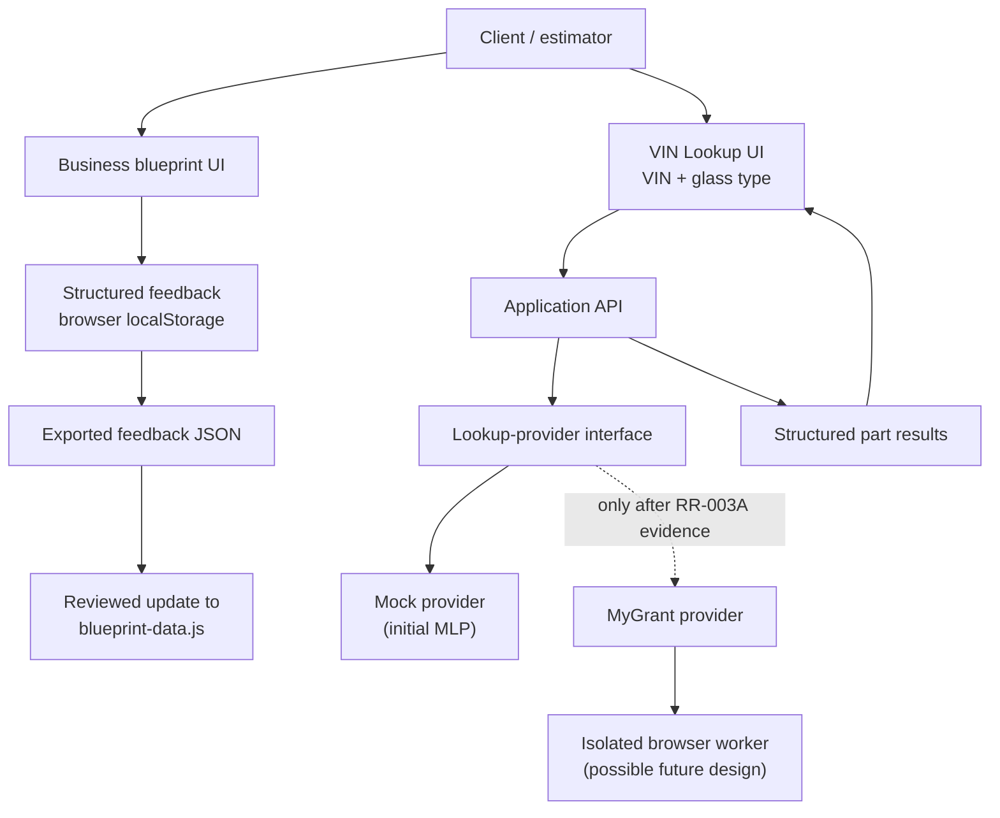
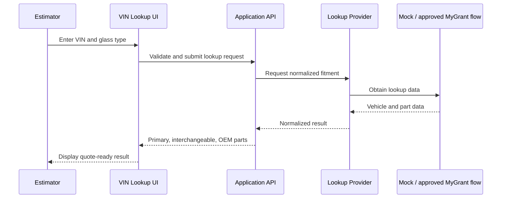
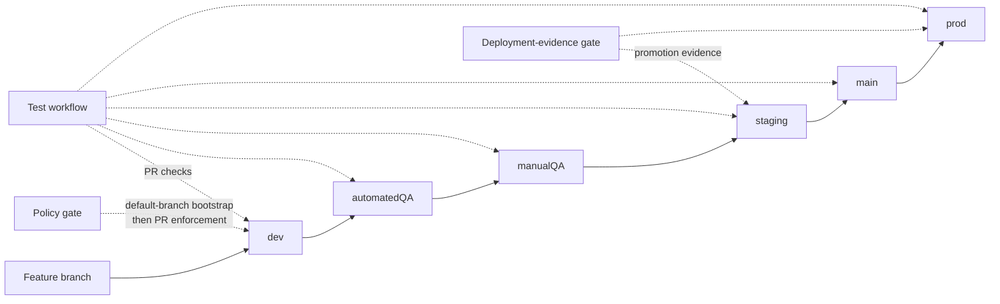
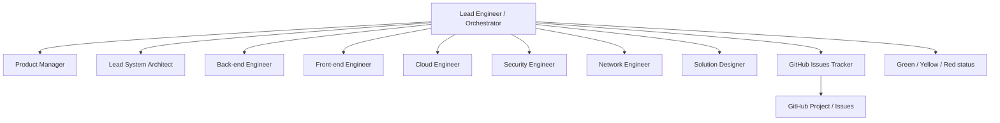

# R&R Finest Auto Glass — Architecture & Operating Model

> **Purpose:** a shared, versioned view of the current business blueprint, the VIN Lookup MLP target architecture, and the delivery system that operates it.

## 1. Product scope and state

The repository currently contains a client-reviewable **business-process blueprint**: an eight-stage visual model of R&R's work from lead acquisition through fulfillment and growth. Reviewers can add structured feedback at every stage or step and export it as JSON.

The next product capability attaches to **Stage 03 — Identify & Quote**:

- enter a VIN as text;
- select the requested glass type;
- look up vehicle and glass-fitment data through a server-side provider;
- return structured primary, interchangeable, and OEM part numbers.

Image-to-VIN is deliberately a later capability. The provider starts as a mock behind an API contract; MyGrant automation can replace it only after the separate feasibility spike proves it is compliant and reliable enough.

## 2. Application architecture

### Modules and responsibilities

| Module | Responsibility | Current / planned |
|---|---|---|
| Business blueprint UI | Visualizes the eight-stage operating lifecycle and each step | Current |
| `blueprint-data.js` | Canonical client-side process model | Current |
| Feedback capture | Stores reviewer comments as structured JSON in the browser | Current |
| Feedback export | Produces portable JSON for review and source-controlled incorporation | Current |
| VIN Lookup UI | Captures VIN text and requested glass type | Planned MLP |
| Application API | Validates requests and returns a stable, provider-neutral result contract | Planned MLP |
| Lookup-provider interface | Decouples the API from the concrete lookup mechanism | Planned MLP |
| Mock provider | Supports a client demo before a production lookup source is approved | Planned MLP |
| MyGrant provider | Performs validated lookup automation behind the existing interface | Blocked by RR-003A |
| Browser worker | Isolates long-running browser automation, retries, and sessions if the feasibility evidence warrants it | Decision pending RR-018 |

## 3. Lookup request flow

**Security boundary:** browser automation, provider credentials, session state, and third-party interactions stay server-side. The browser receives only the structured lookup result. No provider, secret, or deployment endpoint is introduced until its prerequisite issue and review gate are satisfied.

## 4. Delivery and promotion architecture

- Changes move by pull request; direct promotion bypass is not part of the operating model.
- `staging` and `prod` require **jonly03** as the configured GitHub Environment reviewer.
- Environment gates are evidence-only at this stage: no hosting provider, credentials, variables, secrets, or deployment endpoint have been introduced.
- RR-020 promotes the reviewed governance and policy workflow to `main`, resolving the GitHub Actions default-branch bootstrap gap. Until then, specialist-review requirements are procedural rather than technically enforced.
- Before RR-010 introduces a hosting provider, security review must reassess sole-approver risk, branch restrictions, required checks, least privilege, immutable artifacts, rollback, health checks, and secret redaction.

## 5. Specialist-agent operating model

| Role | Primary responsibility | Decision boundary |
|---|---|---|
| Lead Engineer / Orchestrator | Breaks work into specialist tasks, coordinates dependencies, compiles evidence, enforces gates, and reports status | Does not fabricate independent review evidence or make owner-only decisions |
| Product Manager | Confirms business intent, priority, success criteria, and material tradeoffs | Owner decisions |
| Lead System Architect | Maintains module boundaries, delivery sequencing, and architecture coherence | Architecture changes with material tradeoffs go yellow |
| Back-end Engineer | API contract, provider abstraction, validation, result normalization, and automation integration | Cannot introduce a new provider without RR-003A evidence |
| Front-end Engineer | Blueprint interaction, VIN lookup experience, input/output usability, and client feedback flow | Material client-facing UX tradeoffs go yellow |
| Cloud Engineer | Containers, CI/CD, environment configuration, and deployment evidence | No provider/secret/deployment configuration without required gate |
| Security Engineer | Threat review, secret handling, trusted workflow boundaries, and least privilege | Security risk or policy exception goes yellow/red |
| Network Engineer | Ingress/egress, HTTPS, isolation, health checks, and deployment-network posture | Network exposure or unsafe connectivity goes yellow/red |
| Solution Designer | Cross-module fit, maintainability, and delivery-chain consistency | Flags architectural inconsistency before merge |
| GitHub Issues Tracker | Keeps issues, dependencies, evidence links, and Project status accurate | Cannot represent work as done without evidence |

## 6. Green / yellow / red protocol

| Signal | Meaning | Orchestrator action | Owner action |
|---|---|---|---|
| 🟢 Green | Approved to proceed within the documented scope | Assign specialists, execute, verify, and advance the next safe step | None required |
| 🟡 Yellow | A material decision, approval, or independently verified review is required | Pause the affected promotion, summarize options/evidence, and request the specific decision | Review and decide |
| 🔴 Red | A blocker, security issue, failed gate, missing authority, or unsafe condition prevents safe progress | Stop the affected work, preserve evidence, explain impact and remediation path | Resolve blocker or direct a changed scope |

The orchestrator owns coordination. The project owner should not have to manually relay prompts between specialists. A yellow signal must name the exact decision or evidence needed; it must not merely shift coordination work back to the owner.

## 7. Current delivery map

| Item | Status | Next condition |
|---|---|---|
| RR-003A — MyGrant feasibility spike | Blocked | Staging readiness and approval to investigate compliance, login/MFA/CAPTCHA/session behavior, and one narrow extraction |
| RR-003 — MyGrant provider | Blocked | RR-003A evidence |
| RR-008 through RR-012 — container and Render staging | Blocked | RR-020 governance/policy promotion, then sequential prerequisites |
| RR-018 — browser-worker architecture reassessment | Blocked | RR-003 feasibility evidence |
| RR-019 — reusable delivery-workspace starter kit | Blocked | Proven governance, container, staging, and browser-worker patterns |
| RR-020 — activate policy checks from the default branch | In progress | Complete reviewed promotion chain to `main`; verify Test and Policy on a fresh feature PR to `dev` |

## 8. Evidence principles

1. A decision, review, test, or deployment claim is attached to the exact current source and target SHA.
2. Specialist evidence is independent; the orchestrator collects it but does not impersonate it.
3. Changes are verified before promotion and have an explicit rollback path.
4. Project status reflects evidence, not optimism.
5. Customer data, credentials, MyGrant login details, and demo OAuth implementation stay out of reusable tooling.

---
_Last updated: September 15, 2026. This is the architecture baseline for the VIN Lookup MLP V2._
