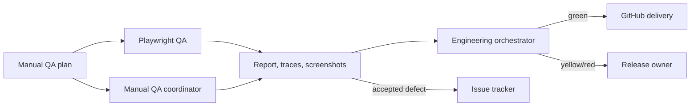

# Turnkey Engineering Workspace

The reusable R&R workspace is distributed as the repository plugin at `.agents/plugins/randr-engineering-team`.

## Specialist boundary

| Skill | Responsibility | Must not do |
|---|---|---|
| `engineering-orchestrator` | Routes work and returns the release signal | Ask the owner to coordinate specialists |
| `solution-architecture-review` | Reviews system shape and operability | Merge or promote changes |
| `security-review` | Reviews authentication, API, browser, and data risk | Claim a GitHub approval |
| `github-delivery` | Verifies PR, Actions, and promotion evidence | Bypass environment approval |
| `playwright-qa` | Executes automated manual-QA scenarios | Mark human-only checks as passed |
| `manual-qa-coordinator` | Guides and records human acceptance testing | Promote without release approval |
| `issue-tracker` | Creates deduplicated, reproducible work items | File unverified or sensitive findings |

## QA contract

`project/manual_qa_test_plan.md` remains the release checklist. The Playwright QA specialist reads that plan and automates only scenarios with deterministic browser assertions. Its baseline suite is `test/manual_qa.playwright.spec.mjs` and writes an HTML report, traces, and failure screenshots.



## Install and use

This repository carries its own marketplace descriptor at `.agents/plugins/marketplace.json`. Once the repository marketplace is available in ChatGPT/Codex, install **Randr Engineering Team** and invoke a specialist by name, or let a matching request select it.

For the browser QA baseline:

```bash
npm ci
npx playwright install --with-deps chromium
npm run test:qa
```

The first implementation targets the R&R VIN Lookup MLP. Future projects reuse the plugin structure, role contracts, green/yellow/red signaling, and QA evidence contract, while replacing the project-specific plan and Playwright scenarios.
